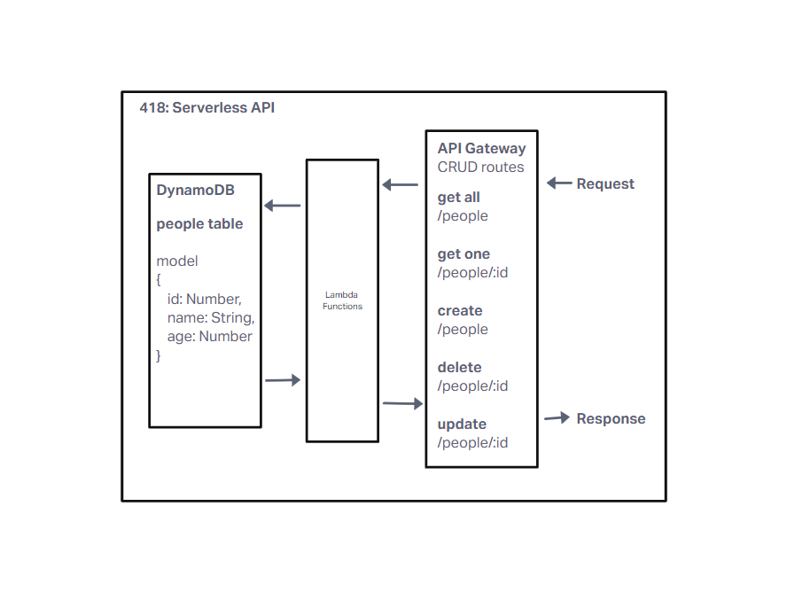

# 418: Serverless API

## What is the root URL to your API?
<!-- Insert Deployed -->

## What are the routes?

**/people**
read all, create

**/people/:id**
read one, update, delete

## What inputs do they require?

req.body for create and update routes

## What output do they return?

**get all**
all people table documents

**get one**
selected people table document

**create**
created people table row

**update**
updated people table row

**delete**
row deletion confirmation
